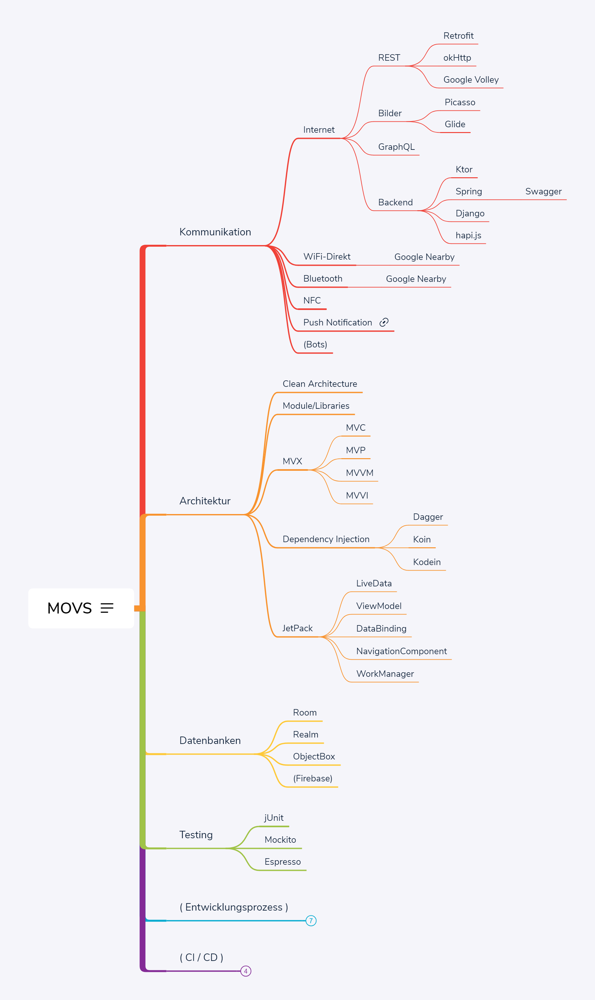

# App Development Technologies

## Android

Here you can see a mind map of some technologies and techniques that can help you build Android apps.

## Flutter

- [Google Codelab](https://flutter.dev/docs/codelabs)
- [Codemagic](https://codemagic.io/)
- [Flutter Widget of the Week](https://www.youtube.com/playlist?list=PLjxrf2q8roU23XGwz3Km7sQZFTdB996iG)

## Other Technologies

- iOS
- Ionic
- React Native
- Xamarin
- ...
